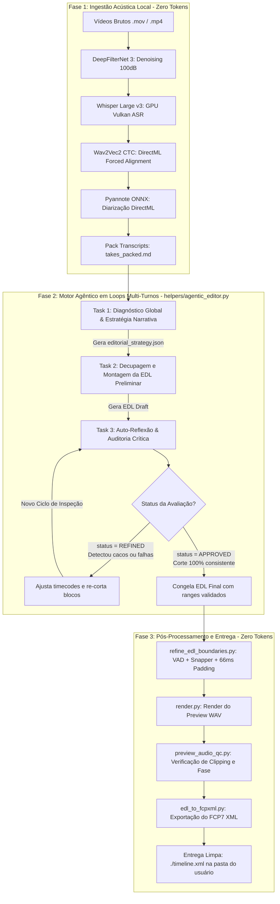

# Alano Rough Cut AI — Arquitetura do Motor Agêntico em Loops Multi-Turnos (v0.6.0)

> **Documento de Referência Arquitetural & Guia para Próximos Agentes de IA / Desenvolvedores**  
> **Versão:** v0.6.0  
> **Branch de Desenvolvimento:** `codex/feature-v0.6.0-agentic-editor`  
> **Status:** Implementado, testado (275/275 unit tests) e integrado na CLI interativa `alanocut`.

---

## 1. Visão Geral e Motivação

Nas versões anteriores (v0.1 a v0.5.0), a tomada de decisão editorial dependia ou de agentes de desenvolvimento externos operando manualmente o terminal, ou de uma chamada estática de LLM em modo **One-Shot** (onde o System Prompt e todo o arquivo `takes_packed.md` eram enviados em uma única mensagem para obter diretamente o JSON de corte).

Embora o One-Shot funcione para vídeos simples, a montagem audiovisual de alta qualidade exige **raciocínio cognitivo em fases**:
1. Primeiro, compreender a história, identificar o que foi gravado e resolver conflitos de retakes;
2. Segundo, montar a primeira versão da linha do tempo;
3. Terceiro, atuar como **Supervisor de Pós-Produção**, inspecionando o próprio trabalho, identificando cacos ou falhas que passaram despercebidos, e corrigindo a timeline antes da entrega.

Na versão **v0.6.0**, implementamos o **Motor Agêntico em Loops Multi-Turnos (*Single-Agent Multi-Turn Cognitive Loop*)**.

---

## 2. Conceito Central: Loop Multi-Turnos vs. Sistema Multiagente

É fundamental esclarecer a distinção arquitetural deste motor:

* **NÃO é um sistema multiagente disperso** (onde vários agentes independentes com ferramentas distintas trocam mensagens de rede e sofrem com descontinuidade de contexto).
* **É um Loop Cognitivo Multi-Turnos de Agente Único (*Single-Agent Sequential Cognitive Loop*)**:
  - Uma única thread conversacional persistente (`messages = [...]`) gerencia todo o ciclo de vida da edição.
  - O mesmo "Editor Sênior" recebe tarefas sequenciais especializadas (*Tasks*), mantendo a memória completa de suas próprias análises anteriores.
  - O agente possui autoridade para criticar a sua própria saída e iterar dinamicamente até atingir o critério de qualidade profissional (`status: "APPROVED"`).

---

## 3. A Máquina de Estados e o Fluxo de Tarefas (Tasks)

---

## 4. Detalhamento de Cada Fase do Motor Agêntico

### 🧠 Task 1: Diagnóstico Global & Estratégia Narrativa (`TASK_STRATEGY`)
* **Arquivo:** [`helpers/prompts/agentic_prompts.py`](file:///O:/Antigravity/alano-cut/.worktrees/codex-feature-v0.4-audio-snapper/helpers/prompts/agentic_prompts.py) (`build_phase1_strategy_prompt`)
* **Entrada:** `brief` do usuário + conteúdo textual completo de `takes_packed.md`.
* **Processamento:**
  - Diagnostica o tipo de conteúdo (aula, reels, tutorial, etc.).
  - Mapeia tentativas concorrentes da mesma fala (*retakes*), selecionando a tentativa vencedora e justificando o descarte das demais.
  - Mapeia a lista de eliminações (cacos de estúdio, confirmações como "Beleza." ou "Tá." isolados entre erros, pigarros, palmas, falas de direção "corta"/"volta").
  - Define a ordem dos blocos narrativos (`HOOK_INTRO`, `DEFINICAO`, `PONTOS_CHAVE`, etc.).
* **Saída Persistida:** Arquivo `editorial_strategy.json` na pasta de sessão do AppData.

---

### ✂️ Task 2: Decupagem e Montagem da Linha do Tempo (`TASK_DRAFT_EDL`)
* **Arquivo:** [`helpers/prompts/agentic_prompts.py`](file:///O:/Antigravity/alano-cut/.worktrees/codex-feature-v0.4-audio-snapper/helpers/prompts/agentic_prompts.py) (`build_phase2_assembly_prompt`)
* **Entrada:** O plano estruturado da Task 1 (presente no histórico conversacional).
* **Processamento:**
  - O agente busca os limites temporais exatos nas transcrições temporizadas para cada bloco planejado.
  - Aplica as regras de *pacing* (ex: flag `is_list: true` para aulas com enumerações, preservando respiros de até 500ms; ou corte agressivo para reels <= 90s).
* **Saída:** Array JSON preliminar de cortes (`ranges: [{source, start, end, beat, quote, reason, is_list}]`).

---

### 🔍 Task 3: Auto-Reflexão & Auditoria Crítica (`TASK_REFLECT_AND_REFINE`)
* **Arquivo:** [`helpers/prompts/agentic_prompts.py`](file:///O:/Antigravity/alano-cut/.worktrees/codex-feature-v0.4-audio-snapper/helpers/prompts/agentic_prompts.py) (`build_phase3_reflection_prompt`)
* **Entrada:** A EDL gerada na Task 2 + histórico completo.
* **Critérios de Auto-Inspeção do Agente:**
  1. *O início de algum corte contém uma confirmação ou caco de bastidor?*
  2. *Algum take descartado na estratégia passou por engano?*
  3. *A ordem dos cortes possui continuidade gramatical e de raciocínio fluida?*
  4. *O ritmo e a duração total estão alinhados ao objetivo do vídeo?*
* **Comportamento Dinâmico:**
  - Se o agente encontrar defeitos: retorna `"status": "REFINED"` com as notas da crítica e a lista de cortes corrigida, iniciando uma nova rodada de reflexão.
  - Se o agente constatar que a montagem está limpa e consistente: retorna `"status": "APPROVED"`.
  - **Teto de Segurança:** Parâmetro `max_reflection_loops` (padrão: 4 ciclos) para prevenir loops infinitos em caso de divergência de formato.

---

## 5. Estrutura de Código e Módulos

| Módulo | Caminho | Responsabilidade |
| :--- | :--- | :--- |
| **Agentic Loop Engine** | [`helpers/agentic_editor.py`](file:///O:/Antigravity/alano-cut/.worktrees/codex-feature-v0.4-audio-snapper/helpers/agentic_editor.py) | Gerenciador de estado, thread conversacional multi-turnos, envio de prompts e validação/normalização de cuts. |
| **Agentic Prompts** | [`helpers/prompts/agentic_prompts.py`](file:///O:/Antigravity/alano-cut/.worktrees/codex-feature-v0.4-audio-snapper/helpers/prompts/agentic_prompts.py) | Prompts modulares para cada fase do agente (Estratégia, Montagem e Crítica/Reflexão). |
| **One-Shot Master Prompt** | [`helpers/prompts/editor_system_prompt.md`](file:///O:/Antigravity/alano-cut/.worktrees/codex-feature-v0.4-audio-snapper/helpers/prompts/editor_system_prompt.md) | Prompt mestre de 46 seções para o modo One-Shot legado/rápido. |
| **LLM HTTP Client** | [`helpers/llm_client.py`](file:///O:/Antigravity/alano-cut/.worktrees/codex-feature-v0.4-audio-snapper/helpers/llm_client.py) | Cliente leve OpenAI-Compatible (`send_chat_completion`), limpeza de JSON e carregamento de credenciais (`.env`). |
| **Orquestrador Central** | [`helpers/orchestrator.py`](file:///O:/Antigravity/alano-cut/.worktrees/codex-feature-v0.4-audio-snapper/helpers/orchestrator.py) | Pipeline unificado de 10 passos. Suporta `--mode agentic` (padrão) e `--mode one-shot`. |
| **TUI Interativa** | [`helpers/interactive_cli.py`](file:///O:/Antigravity/alano-cut/.worktrees/codex-feature-v0.4-audio-snapper/helpers/interactive_cli.py) | Interface de terminal moderna com spinners, tabelas e feedback em tempo real das fases do loop. |
| **Suíte de Testes** | [`tests/test_agentic_editor.py`](file:///O:/Antigravity/alano-cut/.worktrees/codex-feature-v0.4-audio-snapper/tests/test_agentic_editor.py) | Testes unitários do motor agêntico (validação de ranges, prompts, happy path e refinamento). |

---

## 6. Observabilidade, Sessões e Auditoria Editorial

O Alano Cut adota uma arquitetura de **zero poluição de pastas**:
* Todos os arquivos intermediários, caches de ASR, transcrições e logs são armazenados em:
  `%APPDATA%/AlanoCut/sessions/<session_id>/`
* O único arquivo entregue na pasta onde o usuário executou o comando é o **`timeline.xml`**.

### 📄 Relatório de Auditoria (`editorial_audit.txt`)
Cada execução gera automaticamente um relatório legível por humanos com:
1. **Inventário Completo de Mídia:** Resolução, FPS, duração de cada arquivo bruto.
2. **Estratégia & Diagnóstico Agêntico:** Objetivo inferido, estilo de gravação e lista de cacos/ruídos eliminados.
3. **Ciclos de Auto-Reflexão:** Histórico de cada loop de crítica (Loop #1, Loop #2, status e notas da IA).
4. **Decisões de Corte Detalhadas:** Beat narrativo, citação literal e justificativa editorial de cada take escolhido.

---

## 7. Instruções para o Próximo Agente de IA / Desenvolvedor

Se você for o próximo agente a assumir o desenvolvimento deste repositório, atente-se às seguintes diretrizes:

1. **Preservação de Invariantes:**
   - Nunca corte dentro de palavras (`never cut inside a word`).
   - O alinhamento acústico fino é garantido pelo `refine_edl_boundaries.py` (Wav2Vec2 + VAD + padding $\ge 66$ms). A LLM é responsável pela seleção semântica e narrativa.
2. **Evolução do Loop Agêntico:**
   - Se desejar adicionar ferramentas dinâmicas (*tool calling* / MCP), integre-as no loop de `helpers/agentic_editor.py`.
   - Se for implementar o **Modo 2 (Lote de Múltiplos Vídeos / Batch Dispatcher)**, use o `AgenticEditorialLoop` como o worker de contexto limpo para cada vídeo individual gerado pelo dispatcher.
3. **Execução de Testes:**
   - Sempre execute `py -3.12 -m pytest -q` antes de qualquer commit. A suíte atual possui **275 testes automatizados**.
4. **Deploy Local:**
   - Após alterações, sincronize os arquivos em `%APPDATA%/alano-rought-cut-ai` para manter a CLI do usuário atualizada.
