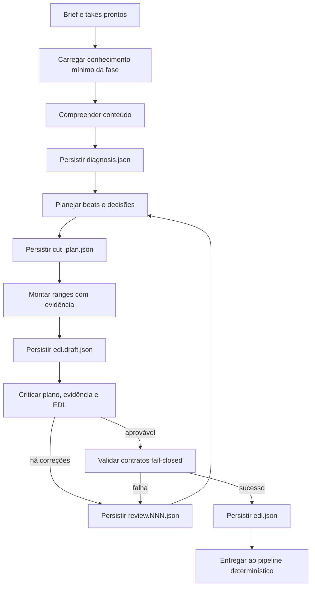
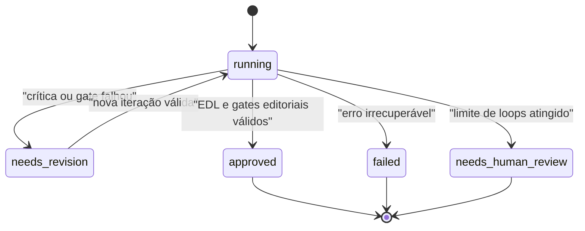

# Loop editorial agêntico v0.6.0

## Objetivo

Substituir a dependência de uma única resposta excepcionalmente competente por um processo editorial decomponível, verificável e compatível com modelos menores, inclusive locais.

A LLM recebe a transcrição pronta. Transcrição, análise acústica, refinamento temporal, preview, QC e exportação XML continuam determinísticos e fora do agente.

## Estado atual

`helpers/agentic_editor.py` mantém uma conversa crescente e executa três fases:

1. **Estratégia:** envia brief e `takes_packed.md` completos, diagnostica o material, resolve retakes e propõe blocos narrativos.
2. **Montagem:** transforma a estratégia em ranges preliminares do EDL.
3. **Reflexão:** critica a EDL e pode devolvê-la refinada; o ciclo repete até aprovação ou limite configurado.

Hoje `helpers/knowledge_loader.py` valida `agent_knowledge/manifest.json` e compõe o núcleo editorial fora do Python; `helpers/prompts/agentic_prompts.py` ainda compõe as tarefas e os formatos JSON do motor de três fases. O cliente `helpers/llm_client.py` retorna somente o texto da resposta: ainda não preserva `usage`, metadados do modelo nem `finish_reason`.

### Nota de migração

O motor atual preserva as três fases e seus JSONs antigos por compatibilidade. Nesta reorganização, o núcleo carregado foi tornado neutro para essa ponte; o motor carrega de `agent_knowledge/` somente identidade/núcleo e o arquétipo correspondente à escolha explícita da TUI. A escolha `custom` não carrega arquétipo. As tasks e schemas de `diagnosis.json`, `cut_plan.json`, `edl.draft.json` e `review.NNN.json` são validados como biblioteca, mas não estão ativados no loop atual. Eles dependem do futuro executor de tools e artefatos.

Esta implementação é uma fundação, não o contrato final. Ela ainda:

- cresce o contexto ao reenviar todo o histórico;
- mantém estado importante apenas na conversa e no retorno em memória;
- aceita alguns fallbacks fail-open;
- não oferece tool calls de arquivos ao modelo;
- não mede tokens por chamada e por sessão.

## Arquitetura desejada

O agente futuro será **artifact-driven**: cada fase lê somente o conhecimento, os inputs e os artefatos necessários; produz um artefato validado; e inicia a fase seguinte com um contexto explícito e mínimo. O histórico do chat deixa de ser a única memória de trabalho.

### Conhecimento modular

O conhecimento do editor vive em `agent_knowledge/`, biblioteca distribuída com a instalação e carregada pelo runtime. Ele é separado das skills do ambiente de desenvolvimento e nunca deve ser copiado ou preparado em um workspace de usuário. O runtime não carrega a árvore inteira por padrão.

Em cada fase, o orquestrador montará um manifesto de contexto com:

- identidade e invariantes editoriais sempre obrigatórios;
- nenhum arquétipo no diagnóstico; depois dele, somente o módulo indicado por `selected_archetype`, que pode ser `null` para `custom`;
- o contrato da fase atual;
- somente os artefatos predecessores necessários;
- evidência da transcrição pertinente à decisão.

O agente pode descobrir e ler módulos adicionais com `read_file`, mas a seleção e as raízes permitidas pertencem ao runtime. Skills de desenvolvimento em `.agents/skills/` nunca entram automaticamente no contexto editorial.

### Fases e artefatos

| Fase | Entradas mínimas | Saída obrigatória | Gate para avançar |
|---|---|---|---|
| Compreensão | brief, takes e invariantes | `diagnosis.json` | schema válido, fontes conhecidas, arquétipo selecionado ou `null`, e incertezas explícitas |
| Planejamento | análise, brief e contrato de planejamento | `cut_plan.json` | beats rastreáveis, cobertura do objetivo e decisões de retake justificadas |
| Montagem | plano, contrato EDL e evidência necessária | `edl.draft.json` | ranges válidos, fonte existente e precisão não superior à evidência |
| Crítica | análise, plano, EDL e evidência citada | `review.NNN.json` | veredito estruturado e cada defeito ligado a uma correção ou bloqueio |
| Finalização editorial | último draft e críticas resolvidas | `edl.json` | schemas, referências e aprovação editorial válidos |

`agent_run.json` registra o estado da sessão; `llm_usage.jsonl` é escrito pelo runtime, não pelo modelo. Os schemas já vivem em `agent_knowledge/schemas/`, mas o executor que os aplica às tool calls ainda precisa ser implementado.

## Tool loop mínimo

A primeira versão do executor deverá expor somente:

- `read_file`: lê conhecimento ou input imutável dentro de raízes permitidas;
- `read_artifact`: lê um artefato da sessão pelo nome lógico;
- `write_artifact`: grava uma saída versionada e compatível com o schema esperado da fase.

Uma futura `read_transcript_slice` poderá fornecer trechos por fonte, intervalo ou cursor quando enviar todos os takes deixar de ser eficiente. Ela não faz parte do escopo inicial.

O runtime executa a chamada, valida os argumentos, realiza a operação e devolve resultado estruturado ao modelo. O modelo não recebe shell, caminhos absolutos nem acesso genérico ao filesystem. O contrato completo está em [AGENT_RUNTIME_TOOLS.md](AGENT_RUNTIME_TOOLS.md).

## Estados e contratos fail-closed

Antes de considerar o agente aprovado:

- toda resposta obrigatória precisa ser JSON válido e compatível com seu schema versionado;
- todo range precisa apontar para fonte e timestamps existentes;
- estratégia, plano e EDL precisam compartilhar beats rastreáveis;
- ausência de arquivo, hash divergente, versão desconhecida ou artifact antigo bloqueia o avanço;
- tool call desconhecida, inválida ou fora do escopo é erro, nunca autorização implícita;
- falha de parse nunca pode assumir `APPROVED`;
- atingir o limite de loops resulta em `needs_human_review`, não em sucesso;
- a crítica avalia brief, análise, plano, evidência e EDL, não somente o JSON dos ranges;
- o XML permanece bloqueado até os gates determinísticos de refinamento e QC passarem.

O runtime é a autoridade sobre estados, schemas e transições. A LLM propõe decisões editoriais; não pode autodeclarar que uma validação técnica ocorreu.

## Controle de contexto

Cada chamada deve nascer de um envelope explícito:

1. instruções imutáveis e contrato da fase;
2. manifesto dos módulos de conhecimento carregados;
3. referências ou conteúdo dos artefatos necessários;
4. evidência de transcrição necessária;
5. orçamento de output e tools disponíveis.

Após validar e persistir um artefato, mensagens intermediárias, resultados repetidos de tool calls e respostas inválidas não devem ser carregados indefinidamente. O runtime reconstrói a próxima chamada a partir do estado persistido e registra hashes para auditoria.

## Telemetria e escolha de modelo

Cada chamada deve registrar consumo informado pelo provedor, ou uma estimativa identificada como tal, além de fase, iteração, latência, tools, validação e resultado. Prompts, transcrições, API keys e respostas brutas não entram no log operacional por padrão.

O GLM-5.2 via NVIDIA NIM será o baseline inicial. Modelos locais menores só devem substituir esse baseline após executar o mesmo conjunto de casos, schemas e gates. A hipótese inicial de contexto confortável é 128K, não uma garantia. Critérios e candidatos estão em [LLM_CONTEXT_AND_TOKEN_BUDGET.md](LLM_CONTEXT_AND_TOKEN_BUDGET.md).

## Critério para iniciar testes do agente

Antes de um corte real, precisam existir:

- schemas versionados para todos os artefatos;
- implementação restrita das três tools;
- runtime fail-closed para parse, tool call, schema, loops e aprovação;
- telemetria por chamada e agregação por sessão;
- fixtures sintéticas que provem isolamento de filesystem e transições de estado;
- harness que execute o mesmo caso no baseline e nos modelos candidatos.

Até esses itens existirem, o contrato de quatro artefatos descreve o alvo arquitetural e não deve ser interpretado como funcionalidade já entregue. Somente o motor de compatibilidade de três fases está ativo.
