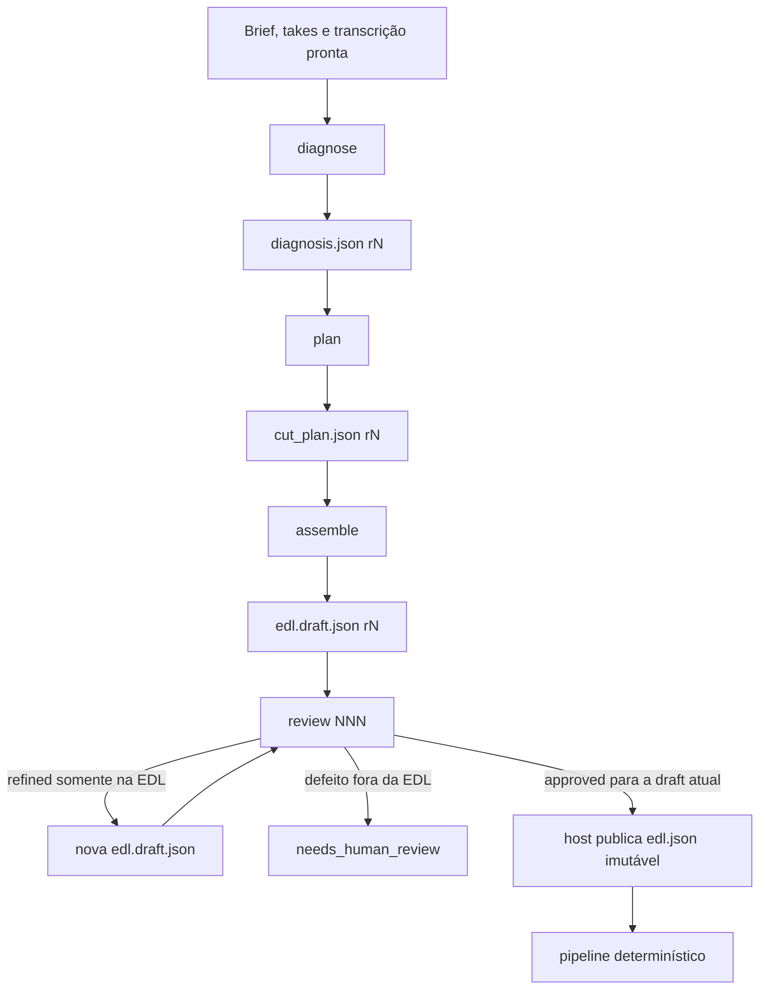
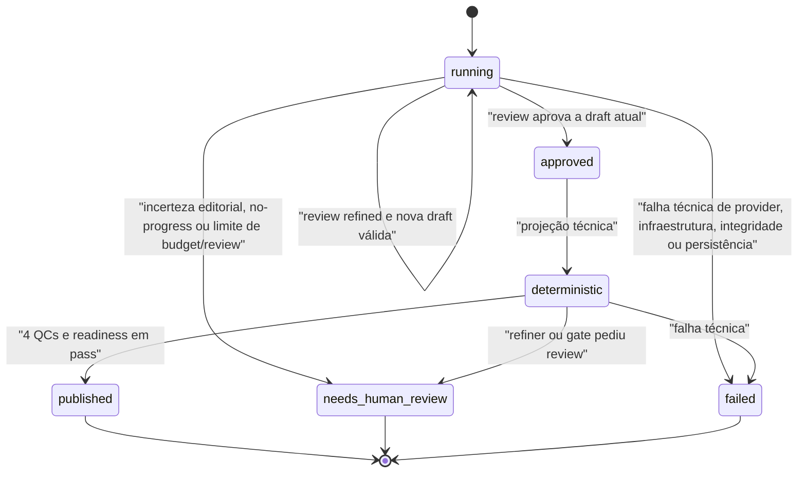

# Loop editorial agêntico v0.6.0

## Objetivo

Trocar uma única resposta excepcionalmente competente por um processo editorial decomponível, verificável e adequado a modelos menores. A LLM recebe a transcrição pronta; transcrição, análise acústica, refinamento temporal, preview, QC e XML continuam sob autoridade do host.

## Estado implementado

`helpers/artifact_agent.py` é o motor do fluxo público. Ele executa quatro fases e só aceita uma fase como concluída depois de uma tool call `write_artifact` validada:

| Fase | Contexto e leituras | Saída | Gate |
|---|---|---|---|
| `diagnose` | brief, takes, identidade e princípios | `diagnosis.json` | status `ready`, fontes/evidências válidas e incertezas explícitas |
| `plan` | diagnosis, brief, takes e arquétipo selecionado ou core-only | `cut_plan.json` | beats rastreáveis, ordem contígua e revisão atual do diagnosis |
| `assemble` | diagnosis, plano, takes, template e transcrições permitidas | `edl.draft.json` | ranges em fonte e boundary canônicos, citação literal e cobertura de beats obrigatórios |
| `review` | diagnosis, plano, draft, brief, takes e transcrições permitidas | `review.NNN.json` | `approved`, `refined` com nova EDL completa ou `needs_human_review` |

O diagnóstico escolhe no máximo um arquétipo. `custom` usa apenas o core. O conhecimento vem de `agent_knowledge/manifest.json`; tasks, contratos e schemas da fase são efetivamente carregados e executados, não apenas validados como biblioteca.

O motor antigo de três prompts e o modo one-shot podem permanecer no repositório como compatibilidade interna, mas o caminho padrão não os chama e não faz fallback automático para eles.

## Contexto reconstruído

Cada fase, inclusive cada iteração de review, começa com uma conversa nova formada por:

1. identidade, princípios, task, contratos e schema selecionados pelo manifesto;
2. envelope com fase, hint de conteúdo quando aplicável, briefing autorizado, número da revisão e recursos lógicos permitidos;
3. descrições curtas das três tools;
4. resultados das tools usados somente durante aquela fase.

O histórico de chat de uma fase não é reenviado à próxima. A memória durável é formada pelos artefatos versionados e pelo ledger host-only. Isso reduz crescimento cumulativo e torna a mesma tarefa comparável entre provedores.



## Loop de tools

O modelo recebe somente:

- `read_file`: conhecimento e inputs imutáveis allowlisted;
- `read_artifact`: última revisão válida de um predecessor permitido;
- `write_artifact`: única saída permitida da fase, com `expected_revision`.

Antes de escrever, a fase precisa ter lido os inputs obrigatórios e todos os predecessores declarados. O host escolhe schema, nome de saída, número de revisão e transição. Texto livre, inclusive JSON correto devolvido como mensagem comum, não conclui a fase.

Uma review `refined` inclui `revised_edl`. O host valida e grava `review.NNN.json` e a nova revisão de `edl.draft.json` na mesma transação. No MVP, apenas defeitos com `repair_scope: edl` podem seguir por esse loop. Reparo de plano, diagnóstico ou evidência é persistido como `needs_human_review`.

O contrato completo das operações está em [AGENT_RUNTIME_TOOLS.md](AGENT_RUNTIME_TOOLS.md).

## EDL editorial e projeção técnica

A LLM trabalha apenas com IDs opacos e com o mapa `source:<ID>`. Paths, nomes originais e identidade física da mídia ficam em `source_registry.json`, fora das tools e prompts.

Quando a review aprova exatamente a última revisão da draft, o host publica uma vez:

```text
edit/agent/artifacts/edl.json   # autoridade editorial imutável
edit/edl.json                   # projeção técnica com paths host-only
```

O refinador altera somente a projeção técnica. Assim, um ajuste acústico de frame não reescreve silenciosamente o que a LLM aprovou.

## Estados e falhas



Comportamentos fail-closed:

- JSON duplicado, número não finito, schema inválido ou invariantes semânticos divergentes bloqueiam a escrita;
- ranges precisam coincidir com boundaries das palavras e a `quote` precisa corresponder à evidência literal do intervalo;
- leitura de artefato antigo, hash alterado ou `expected_revision` incorreto gera conflito;
- tool desconhecida, path fora da allowlist, link/reparse point ou acesso entre sessões falha;
- repetição idêntica sem progresso, estouro de chamadas/bytes e ausência recorrente de tool encerram a fase;
- o limite de review termina em `needs_human_review`, nunca em aprovação presumida;
- review aprovada não basta para publicar XML: boundary, áudio, semântica, transcrição do preview e readiness precisam passar.

## Telemetria sem chain-of-thought

`edit/agent/llm_usage.jsonl` registra uma linha sanitizada por chamada: fase, iteração, modelo, latência, `finish_reason`, tokens retornados pelo provedor, nomes das tools, validação, resultado e código de erro.

`edit/agent/agent_run.json` agrega estado, fase, iterações, quantidade de chamadas, totais de prompt/completion e cadeia de nomes, revisões e hashes dos artefatos. `session.log` acrescenta somente resumos estruturados, como arquétipo, quantidade de beats e ranges.

A TUI apresenta as etapas, o conjunto das quatro fases e estados reais. O detalhamento de nomes de tools e decisões estruturadas fica na telemetria e na auditoria da sessão; não inclui pensamento privado. Prompt, brief, transcrição, conteúdo de tool results, resposta bruta, chain-of-thought, segredo e path físico não entram nesses logs.

## Modelo e contexto

GLM-5.2 via NVIDIA NIM é a baseline de desenvolvimento. A hipótese de uma janela local de 128K continua aberta e precisa ser medida com `llm_usage.jsonl`; a janela anunciada de 1M não é requisito do produto. Consulte [LLM_CONTEXT_AND_TOKEN_BUDGET.md](LLM_CONTEXT_AND_TOKEN_BUDGET.md).

## Limitações atuais

- Não há resume automático pós-crash. Os artefatos permitem auditoria, mas uma nova chamada `alanocut` cria outra sessão.
- Um `.artifact.lock` abandonado bloqueia aquele store; remover lock sem provar abandono não é automatizado.
- Transcrição canônica sem palavras falha como input inválido. Uma política para fonte silenciosa ainda precisa ser desenhada.
- `read_transcript_slice`, busca semântica e memória vetorial não fazem parte do MVP; transcripts inteiros continuam disponíveis nas fases que precisam de evidência.
