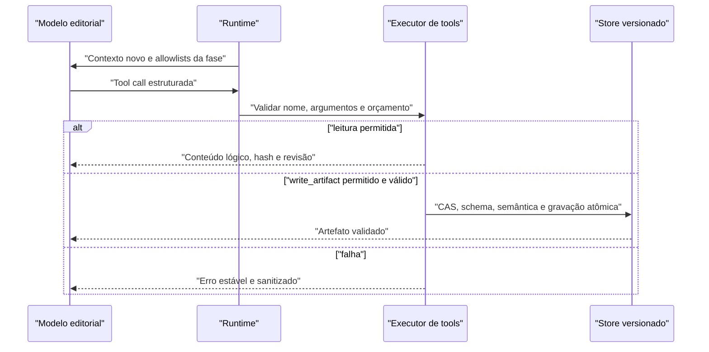

# Tools do agente editorial

Status: implementado e ativo no fluxo público v0.6.

## Escopo

O agente editorial lê sua inteligência, consulta evidência pronta e persiste decisões de corte. Ele não recebe shell, rede arbitrária ou filesystem genérico. `helpers/agent_tools.py` expõe somente:

1. `read_file` para conhecimento e inputs imutáveis;
2. `read_artifact` para estado editorial validado da sessão;
3. `write_artifact` para a única saída permitida da fase.

O host controla roots, allowlists, schemas, revisões, orçamentos e transições. O modelo nunca escolhe um path físico nem publica a EDL final.

## Recursos lógicos

| Classe | Conteúdo | Permissão |
|---|---|---|
| `knowledge` | arquivos selecionados de `agent_knowledge/` para a fase | `read_file` |
| `input` | `brief.md`, `takes_packed.md`, template e transcripts allowlisted da sessão | `read_file` |
| `artifact` | predecessores validados do run atual | `read_artifact` |
| `write` | um nome derivado da fase, como `diagnosis.json` | `write_artifact` |

O envelope da fase informa somente nomes lógicos. `agent_knowledge/` permanece na instalação; inputs e artefatos ficam dentro da sessão. A pasta dos vídeos, `.env`, configuração de provedor, caches, código, mídia bruta, `source_registry.json` e outras sessões não são recursos do modelo.

Paths absolutos, UNC, de dispositivo, com drive/ADS, `..`, backslash, NUL ou componente não allowlisted são rejeitados. Roots e componentes existentes não podem ser symlink, junction ou reparse point. A leitura compara identidade e metadados antes/depois para detectar mutação concorrente.

## Contrato comum

Cada resposta usa o mesmo envelope:

```json
{
  "call_id": "call_01",
  "ok": true,
  "result": {},
  "error": null
}
```

Em falha, `ok` é `false`, `result` é `null` e `error.code` é estável. Os códigos suportados incluem `INVALID_ARGUMENT`, `NOT_FOUND`, `OUTSIDE_ALLOWED_ROOT`, `SCHEMA_MISMATCH`, `SEMANTIC_MISMATCH`, `STATE_CONFLICT`, `SIZE_LIMIT`, `INVALID_JSON`, `INTEGRITY_FAILURE`, `READ_FAILED`, `BUDGET_EXCEEDED`, `NO_PROGRESS` e `NEEDS_HUMAN_REVIEW`.

A mensagem de erro não ecoa exceção interna, conteúdo privado ou path físico.

## `read_file`

### Chamada

```json
{
  "path": "archetypes/educational_explainer.md"
}
```

### Resultado

```json
{
  "path": "archetypes/educational_explainer.md",
  "sha256": "<hash>",
  "bytes": 1234,
  "content": "<texto UTF-8>"
}
```

### Regras

- `path` precisa estar na composição de conhecimento ou na allowlist de inputs da fase;
- o runtime decide a root; o modelo não envia `knowledge/` ou `input/` como path físico;
- artefatos nunca são lidos por esta tool;
- UTF-8 inválido, arquivo ausente, mutável, linkado ou acima do limite falha por inteiro;
- o hash cobre exatamente os bytes devolvidos.

## `read_artifact`

### Chamada

```json
{
  "name": "cut_plan.json",
  "revision": 2
}
```

`revision` é opcional. O resultado sempre precisa corresponder à última revisão válida; pedir uma revisão antiga não permite raciocinar sobre estado obsoleto.

### Resultado

```json
{
  "name": "cut_plan.json",
  "revision": 2,
  "schema": "schemas/cut-plan.schema.json",
  "sha256": "<hash>",
  "content": {}
}
```

O store verifica associação ao `run_id`, índice, hash, tamanho, schema e revisões dos predecessores antes de expor o conteúdo.

## `write_artifact`

### Chamada

```json
{
  "name": "edl.draft.json",
  "expected_revision": 0,
  "content": {
    "schema_version": 1
  }
}
```

### Resultado

```json
{
  "artifacts": [
    {
      "name": "edl.draft.json",
      "revision": 1,
      "schema": "schemas/edl.schema.json",
      "sha256": "<hash>",
      "state": "validated"
    }
  ]
}
```

O array pode conter a review e uma nova draft quando uma revisão `refined` é confirmada transacionalmente.

### Regras

- o nome precisa ser exatamente o output da fase;
- todos os inputs obrigatórios e predecessores precisam ter sido lidos nesta fase;
- `expected_revision` implementa compare-and-swap e bloqueia overwrite baseado em estado antigo;
- o host escolhe schema e aplica revisão, hashes e referências aos predecessores;
- JSON usa parse estrito: chaves duplicadas, valores não finitos, profundidade/tamanho excessivos e campos incompatíveis falham;
- JSON Schema Draft 2020-12 e invariantes editoriais são validados offline;
- a escrita usa staging, `fsync` e replace atômico; uma falha não promove output parcial;
- `review.NNN.json` e a draft refinada entram na mesma transação lógica;
- `edl.json` é host-only e nasce apenas de uma review aprovada para a última draft.

## Matriz por fase

| Fase | Leitura de artefato | Escrita |
|---|---|---|
| `diagnose` | nenhuma | `diagnosis.json` |
| `plan` | `diagnosis.json` | `cut_plan.json` |
| `assemble` | `diagnosis.json`, `cut_plan.json` | `edl.draft.json` |
| `review` | `diagnosis.json`, `cut_plan.json`, `edl.draft.json` | `review.NNN.json` |

Inputs de arquivo são definidos em `agent_knowledge/manifest.json`. Transcripts podem ser consultados apenas nas fases declaradas; o agente não obtém acesso a uma fonte porque adivinhou seu nome.

## Artefatos e autoridade

| Artefato | Escritor | Papel |
|---|---|---|
| `diagnosis.json` | modelo via host | diagnóstico, retakes, evidência e incertezas |
| `cut_plan.json` | modelo via host | beats, ordem, exclusões e pacing |
| `edl.draft.json` | modelo/host | ranges editoriais ainda revisáveis |
| `review.NNN.json` | modelo via host | achados, escopo de reparo e veredito |
| `edl.json` | host | cópia editorial aprovada e imutável |
| `agent_run.json` | host | estado agregado, chamadas e hashes |
| `llm_usage.jsonl` | host | uma linha sanitizada por completion |

Revisões físicas ficam sob `edit/agent/artifacts/.revisions/`; o índice associa cada nome, número, schema, hash, tamanho e timestamp ao run. O modelo não recebe essa estrutura física.

## Execução de uma fase



Por padrão, cada fase limita completions, tool calls e bytes lidos/escritos; review também limita iterações. Repetições idênticas e completions sem tool contam como no-progress. Esgotar o orçamento termina em `needs_human_review`, sem artefato ou XML presumido.

## Segurança e telemetria

- A configuração da LLM vem somente da instalação confiável ou do ambiente do processo.
- Source IDs opacos substituem nomes e paths no prompt. O registry físico é host-only.
- API keys, headers, prompts, brief, transcrições, argumentos/resultados completos, respostas brutas e chain-of-thought não são registrados.
- Logs podem conter fase, iteração, tool, contagens, latência, tokens, revisão, hash, status e código de erro.
- Um lock existente bloqueia a escrita. Não há remoção automática de lock abandonado nem resume pós-crash nesta versão.

## Extensões futuras

`read_transcript_slice` só deve ser adicionado se a telemetria provar que transcripts completos dominam o contexto. Ele precisará preservar palavra, timestamp, hash, paginação e visibilidade de resultado parcial. Busca semântica, banco vetorial e execução de código não pertencem ao MVP atual.
