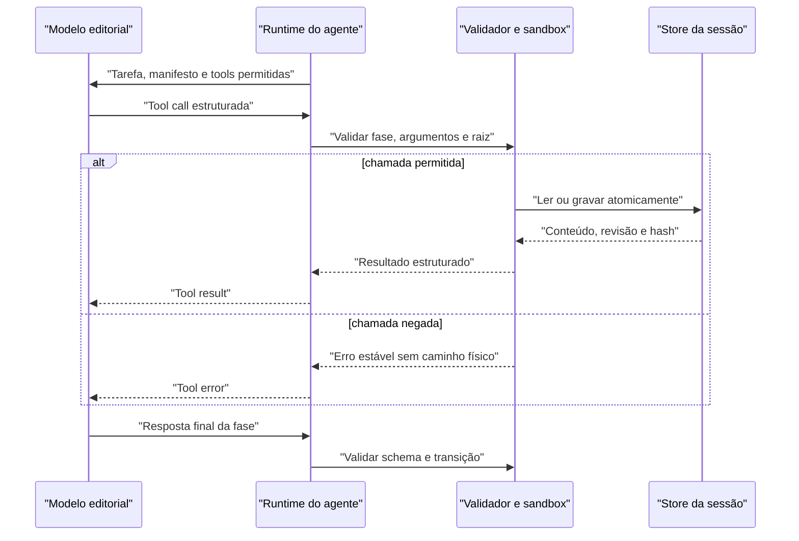

# Tools do agente editorial

Status: contrato planejado e ainda não executável. O motor de compatibilidade de três fases não oferece estas tools à LLM.

## Objetivo e escopo

O agente editorial precisa ler sua inteligência, consultar os takes e persistir decisões de corte. Isso não exige shell nem acesso irrestrito ao sistema. A primeira versão planejada exporá somente três operações com raízes lógicas e contratos estreitos:

1. `read_file` para conhecimento e inputs imutáveis;
2. `read_artifact` para estado produzido na sessão;
3. `write_artifact` para novas decisões estruturadas.

O futuro executor realizará as operações em nome do modelo, validará entrada e saída e manterá a autoridade sobre caminhos, schemas, estados e aprovação. Os contratos e schemas em `agent_knowledge/` já são validados como biblioteca, mas isso não significa que as tool calls estejam implementadas.

## Fronteiras de acesso

`agent_knowledge/` é biblioteca da instalação do AlanoCut e fonte da raiz lógica `knowledge`; ela não é materializada dentro do workspace do usuário. O modelo nunca recebe nem envia um caminho absoluto. O runtime resolve cada nome relativo contra raízes conhecidas:

| Raiz lógica | Conteúdo | Permissão do agente |
|---|---|---|
| `knowledge` | módulos editoriais distribuídos com o produto | somente leitura |
| `input` | brief, takes, transcrições canônicas e `edl_template.json` da sessão | somente leitura |
| `artifact` | outputs validados da sessão atual | leitura e escrita mediadas pelas tools |

O runtime resolve a raiz lógica para um diretório canônico, rejeita traversal, links simbólicos que escapem da raiz, extensões não permitidas e arquivos maiores que o limite configurado. O agente não acessa `.env`, configuração de provedor, caches globais, mídia bruta ou arquivos de outras sessões.

## Contrato comum

Toda tool call contém um `call_id`, nome e argumentos JSON. Toda resposta do runtime contém:

```json
{
  "call_id": "call_01",
  "ok": true,
  "result": {},
  "error": null
}
```

Em falha, `ok` é `false`, `result` é `null` e `error` usa um código estável, por exemplo `INVALID_ARGUMENT`, `NOT_FOUND`, `OUTSIDE_ALLOWED_ROOT`, `SCHEMA_MISMATCH`, `STATE_CONFLICT` ou `SIZE_LIMIT`. Texto de exceção interno e caminhos físicos não são devolvidos ao modelo.

## `read_file`

Lê texto imutável das raízes `knowledge` ou `input`.

### Argumentos

```json
{
  "path": "archetypes/educational_explainer.md"
}
```

### Resultado

```json
{
  "path": "archetypes/educational_explainer.md",
  "sha256": "<hash>",
  "bytes": 1234,
  "content": "<texto>"
}
```

### Regras

- `path` é relativo, normalizado e pertence ao manifesto da fase ou às entradas allowlisted da sessão;
- o runtime decide se o recurso vem de `knowledge` ou `input`; o modelo não escolhe a raiz física;
- artefatos nunca são aceitos por `read_file` e só podem ser consultados por `read_artifact`;
- leitura parcial silenciosa é proibida; limite excedido retorna erro;
- o hash representa exatamente os bytes lidos;
- UTF-8 inválido, arquivo ausente ou mutação entre resolução e leitura falham de forma fechada.

## `read_artifact`

Lê um artefato validado da sessão atual pelo nome lógico, nunca por caminho livre.

### Argumentos

```json
{
  "name": "cut_plan.json",
  "revision": 2
}
```

`revision` é opcional. Sem ela, o runtime retorna a última revisão válida. Um artefato inválido, pertencente a outra sessão ou produzido por uma fase incompatível não é exposto.

### Resultado

```json
{
  "name": "cut_plan.json",
  "revision": 2,
  "schema": "schemas/cut-plan.schema.json",
  "sha256": "<hash>",
  "content": {}
}
```

## `write_artifact`

Solicita a gravação de uma saída estruturada da fase atual.

### Argumentos

```json
{
  "name": "edl.draft.json",
  "expected_revision": 0,
  "content": {
    "version": 1
  }
}
```

### Resultado

```json
{
  "name": "edl.draft.json",
  "revision": 1,
  "schema": "schemas/edl.schema.json",
  "sha256": "<hash>",
  "state": "validated"
}
```

### Regras

- o nome precisa estar permitido para a fase atual;
- o runtime escolhe o schema pela fase e pelo nome; a LLM não pode substituí-lo;
- `expected_revision` precisa corresponder à revisão atual, impedindo sobrescrita concorrente ou baseada em estado antigo;
- a escrita ocorre em arquivo temporário, seguida de validação e substituição atômica;
- uma versão válida anterior não é sobrescrita em caso de falha;
- JSON duplicado, não finito, grande demais ou com campos desconhecidos conforme o schema é rejeitado;
- a LLM não publica `edl.json`; após uma revisão `approved`, o runtime copia de forma imutável a última `edl.draft.json` validada e ainda executa os gates determinísticos.

## Artefatos previstos

| Artefato | Produtor | Finalidade |
|---|---|---|
| `diagnosis.json` | agente | diagnóstico, estrutura, retakes e incertezas |
| `cut_plan.json` | agente | beats, ordem, cobertura e decisões editoriais |
| `edl.draft.json` | agente | ranges preliminares rastreáveis |
| `review.NNN.json` | agente | defeitos, evidências e ações da iteração |
| `edl.json` | runtime após aprovação | cópia imutável da EDL editorial aprovada para o pipeline determinístico |
| `agent_run.json` | runtime | estado, versões, hashes, loops e gates |
| `llm_usage.jsonl` | runtime | uma linha de telemetria por chamada |

O modelo nunca escreve `edl.json`, `agent_run.json` ou `llm_usage.jsonl` diretamente.

## Loop de execução



Cada fase possui limite de chamadas, limite de bytes lidos/escritos e timeout. Repetição idêntica sem progresso, argumentos inválidos recorrentes ou estouro de orçamento encerram a fase como falha ou `needs_human_review`; não liberam um resultado parcial.

## Tool futura: `read_transcript_slice`

Se a telemetria mostrar que os takes dominam o contexto, uma operação específica poderá consultar evidência por `source_id`, intervalo temporal, beat ou cursor. Ela deve:

- devolver palavras e timestamps canônicos sem reescrever a evidência;
- incluir hash e coordenadas da fonte;
- ter paginação e limite determinísticos;
- impedir buscas fora das fontes registradas na sessão;
- manter visível quando o resultado é parcial.

Essa tool só deve ser adicionada após benchmark demonstrar necessidade. Busca semântica, banco vetorial e execução de código não pertencem ao MVP.

## Segurança e privacidade

- API keys e headers nunca entram em prompts, artefatos ou logs.
- Prompts, transcrições, conteúdo de tool results e respostas brutas não são registrados por padrão.
- Logs usam IDs, contagens, nomes lógicos, hashes, tamanhos, estados e códigos de erro.
- O runtime não segue links simbólicos nem aceita caminhos UNC, de dispositivo, absolutos ou com segmentos ascendentes.
- Toda sessão possui diretório e identificador próprios; o runtime verifica essa associação a cada operação.
- Falhas não podem incluir conteúdo sensível em mensagens de exceção.

## Testes obrigatórios antes de um corte real

- traversal por `..`, caminho absoluto, UNC e link simbólico;
- leitura e escrita fora da raiz ou de outra sessão;
- allowlist de nomes, extensões, tamanho e fase;
- JSON e schema inválidos;
- conflito de `expected_revision`;
- escrita atômica interrompida;
- loop de tool calls sem progresso;
- ausência ou adulteração de artefato predecessor;
- garantia de que logs não contenham API key, brief, transcrição ou resposta bruta.
