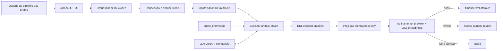
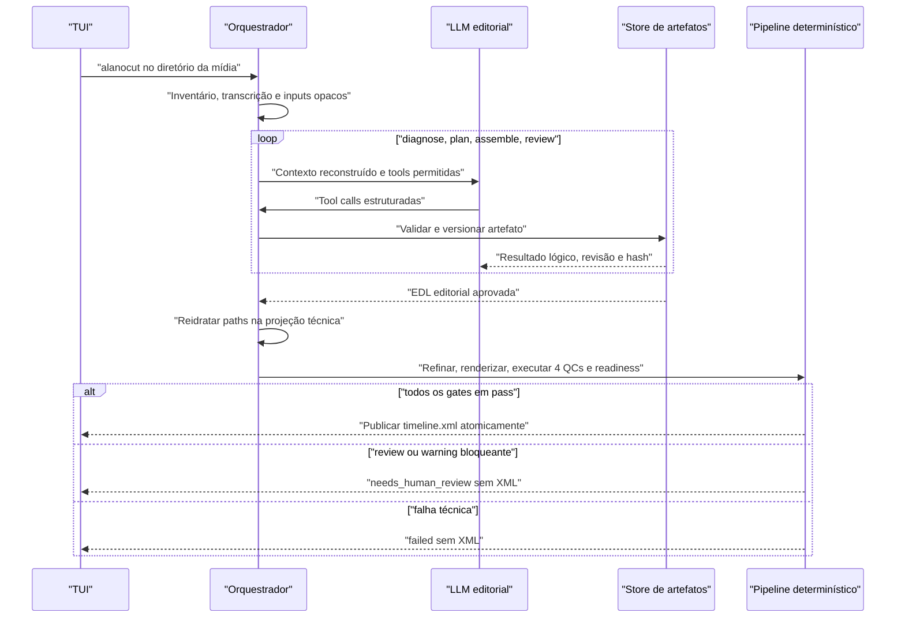

# Arquitetura v0.6.0

Atualizado em 2026-08-21.

## Princípios

1. **Local-first:** mídia, transcrição, análise acústica, artefatos, QC e XML permanecem na máquina do usuário.
2. **LLM isolada da mecânica:** a LLM decide a edição; o host controla filesystem, schemas, revisões, gates e publicação.
3. **EDL como contrato:** a EDL editorial imutável é a fronteira entre raciocínio editorial e execução técnica.
4. **Evidência auditável:** decisões temporais apontam para fontes lógicas e boundaries presentes na transcrição canônica.
5. **Fail-closed:** ausência, parse inválido, estado `review`, hash antigo, schema divergente ou gate incompleto bloqueia o XML.
6. **Cross-vendor no Windows:** Vulkan e DirectML evitam manter uma pipeline diferente para AMD, NVIDIA e Intel.

## Visão de componentes

### Entrada e sessão

- `bin/alanocut.ps1`: inicia a instalação global usando somente `alanocut`, sem argumentos.
- `helpers/interactive_cli.py`: detecta toda a mídia suportada no diretório atual, coleta tipo de vídeo e briefing opcional e apresenta estados reais do pipeline.
- `helpers/orchestrator.py`: congela o inventário, prepara entradas lógicas, executa o agente e encadeia todos os gates.
- `helpers/session_manager.py`: cria uma sessão exclusiva em `%LOCALAPPDATA%\AlanoCut\sessions` e publica `timeline.xml` por replace atômico.

Todos os arquivos detectados no diretório pertencem a um único projeto de edição. Três arquivos de câmera, por exemplo, podem ser três fontes/takes do mesmo vídeo final; o runtime não cria uma sessão editorial por arquivo.

### Transcrição local

- `helpers/audio_analysis.py`, `helpers/transcribe.py` e `helpers/transcribe_batch.py`: DeepFilterNet e entrada do pipeline local.
- `helpers/vulkan_runtime.py`: resolução e validação do Whisper/Vulkan.
- `helpers/forced_alignment.py`: alinhamento CTC palavra a palavra com Wav2Vec2/DirectML.
- `helpers/directml_diarization.py`: diarização Pyannote ONNX/DirectML.
- `helpers/transcription_contract.py`: contrato canônico, timing e proveniência.
- `helpers/pack_transcripts.py`: visão editorial condensada em `takes_packed.md`.

WhisperX e provedores cloud ainda podem aparecer em código de compatibilidade, mas estão fora do caminho canônico v0.6. Sua remoção depende de análise controlada de dependências.

### Executor editorial

- `helpers/artifact_agent.py`: executa `diagnose -> plan -> assemble -> review` e reconstrói a conversa a cada fase.
- `helpers/agent_tools.py`: expõe somente `read_file`, `read_artifact` e `write_artifact`, com allowlist e orçamentos por fase.
- `helpers/agent_artifacts.py`: store com revisões imutáveis, CAS por `expected_revision`, schemas Draft 2020-12 e invariantes semânticos.
- `helpers/agent_telemetry.py`: grava telemetria sem conteúdo em `llm_usage.jsonl` e o ledger agregado `agent_run.json`.
- `helpers/knowledge_loader.py`: valida e compõe seletivamente a biblioteca declarada em `agent_knowledge/manifest.json`.
- `helpers/llm_client.py`: cliente estruturado OpenAI-compatible, com tool calls, `usage`, metadados seguros, resposta limitada e redirects bloqueados.
- `helpers/editorial_edl_bridge.py`: publica a EDL editorial e cria a projeção técnica separada.

`agent_knowledge/` integra a instalação e não é copiado para a pasta de mídia. `.agents/skills/` pertence somente ao squad de desenvolvimento e nunca compõe prompts editoriais.

Os módulos antigos `helpers/agentic_editor.py`, `helpers/prompts/agentic_prompts.py` e `helpers/prompts/editor_system_prompt.md` permanecem como legado interno enquanto a limpeza não for concluída. O fluxo público não os usa como fallback.

### EDL, refinamento e QC

- `edit/agent/artifacts/edl.json`: cópia editorial aprovada e imutável, com referências `source:<ID>`.
- `edit/edl.json`: projeção técnica separada, com paths reidratados pelo host; o refinador pode alterá-la sem reescrever a decisão editorial.
- `helpers/refine_edl_boundaries.py`: ajusta boundaries e produz `edl_boundary_qc.json`.
- `helpers/render.py`: gera `preview.wav` e `preview_timeline.json`.
- `helpers/preview_audio_qc.py`: produz `preview_audio_qc.json`.
- `helpers/semantic_qc.py`: produz `edl_semantic_qc.json`.
- `helpers/preview_transcript_qc.py`: produz `preview_transcript_qc.json` e a transcrição independente do preview.
- `helpers/verify_edit_ready.py`: agrega os quatro relatórios e a identidade dos artefatos no readiness gate.
- `helpers/edl_to_fcpxml.py`: reexecuta o readiness guard e exporta FCP7/XMEML apenas quando ele passa.

## Fronteira de fontes e privacidade

O host deriva um ID opaco e determinístico para cada fonte, rejeita colisões e materializa os inputs da LLM sob `edit/agent/inputs`. O brief, `takes_packed.md`, transcripts e template são reescritos para usar somente esses IDs.

`edit/agent/source_registry.json` associa IDs a paths físicos e identidade de arquivo. Esse registro é host-only: não pertence ao manifesto de tools, não entra no prompt e não é copiado para o diretório dos brutos. Antes da projeção técnica, o orquestrador também confirma que a mídia inventariada não mudou.

## Fluxo editorial e técnico

## Estados fail-closed

- Cada fase só termina depois de `write_artifact` validado; JSON em texto livre não é uma saída válida.
- O host, não a LLM, atribui revisões e publica `edl.json` após `review` com status `approved` para a última draft.
- Uma revisão `refined` pode alterar apenas a EDL no MVP. Defeito que exige mudar plano, diagnóstico ou evidência termina em `needs_human_review`.
- Limites de chamadas, bytes, repetição sem progresso e iterações encerram a sessão sem aprovação implícita.
- Exit code de revisão do refinador ou readiness, relatório ausente/antigo e qualquer erro de gate bloqueiam XML.
- A publicação final tem nome fixo `<cwd>/timeline.xml` e usa arquivo temporário seguido de replace atômico.

## Configuração e observabilidade da LLM

O cliente lê `LLM_API_KEY`, `LLM_BASE_URL` e `LLM_MODEL` somente do `.env` da raiz confiável da instalação ou do ambiente do processo. Configuração dentro da pasta de mídia é input não confiável e é ignorada. Endpoints remotos exigem HTTPS; HTTP é restrito a loopback.

A TUI mostra etapas, o conjunto de fases e estados estruturados de sucesso ou revisão. A auditoria registra nomes de fase e tool, contagens, latência, uso retornado pelo provedor, hashes e decisões estruturais suficientes para diagnosticar a execução. Prompt, brief, transcrição, tool result, resposta bruta, chain-of-thought, segredo e path físico não são telemetria operacional.

## Limitações conhecidas

- Não existe retomada automática de uma sessão após crash; uma nova execução cria outra sessão.
- Um `.artifact.lock` abandonado bloqueia aquele store. A recuperação automática ainda não possui um protocolo seguro de prova de abandono.
- Uma fonte canônica sem `words` é rejeitada como `INVALID_INPUT`. Mídia silenciosa precisa de uma política editorial explícita futura; não vira uma EDL vazia por fallback.
- O executor e os gates possuem cobertura automatizada, mas a qualidade dos cortes ainda depende de validação humana em corpus real e no Premiere Pro.

## Interface pública

`alanocut`, sem subcomandos ou argumentos e executado no diretório dos brutos, é a única interface pública. A TUI é provisória. Electron e Tauri continuam possibilidades para uma GUI futura, não decisões da v0.6.

A separação entre squad, conhecimento editorial e host Python segue o [ADR 0001](adr/0001-separar-agentes-de-desenvolvimento-e-conhecimento-editorial.md).
